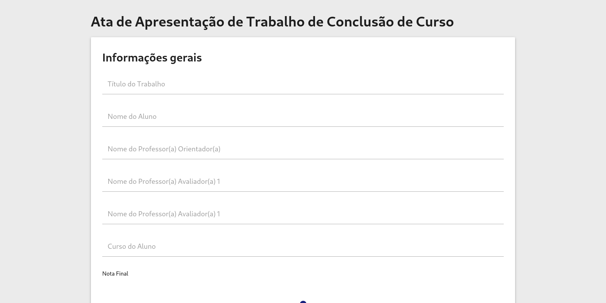

# Projeto extra: Formulários de avaliação e ata de TCC

[Deploy no Github Pages](https://elc1090.github.io/extra-2025a-eduardomsilveira/)

### Desenvolvedor(a)
Eduardo de Medeiros da Silveira - Ciência da Computação

### Produto
Aplicativo para registrar apresentações de TCC e gerar PDF.

### Desenvolvimento
Tive que implementar funcionalidades a partir de um código existente. O trabalho foi muito interessante e desafiador, já que tive que compreender o funcionamento de boa parte do projeto antes de começar a implementar os requisitos do trabalho. Além disso, tive que lidar com coisas que eu nunca tinha lidado antes, como algumas partes da API do Javascript, e as bibliotecas Materialize e pdfmake. Durante esse trabalho, percebi como as linguagens dinâmicas podem dificultar o desenvolvimento quando é necessário refatorar grande parte do código, já que as mudanças no código só geram erros em tempo de execução. Como faz falta um type checker!

#### Tecnologias
- Javascript
- CSS 
- HTML
- Materialize

#### Ambiente de desenvolvimento
- Neovim
- Firefox 

#### Referências e créditos
- [Referência de Features](https://github.com/diovani-f/TCC) 
- [Referência Estrutural](https://github.com/elc1090/project1-2024a-pizzutta-fork/)
- [Colunas no pdfmake](https://pdfmake.github.io/docs/0.1/document-definition-object/columns/)

---
Projeto entregue para a disciplina de [Desenvolvimento de Software para a Web](http://github.com/andreainfufsm/elc1090-2025a) em 2025a
